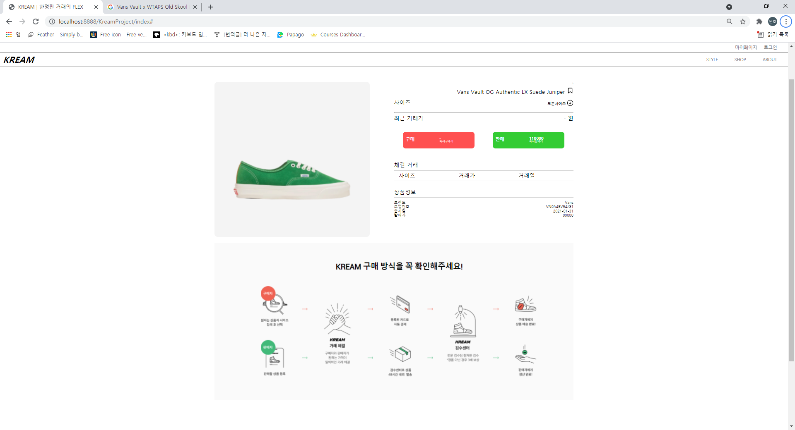

# Kream Project

## 개요 ##

1. 보유 기술 스택
2. 프로젝트
	1.  실습과제명
	2.  수행기간
	3.  참가인원
	4.  담당 업무
	5.  수행목표
	6.  사용기술

3. 상세내용
	1. DB 설계
	2. 시행착오
	3. 고찰
	4. 개선방안

## 1. 보유 기술 스택 ##

Java
--
	Spring
	Spring boot
	JPA
	Servlet
	Jsp
	Jstl
	
Java Script
--
	JQuery
	Vanila JavaScript
html5, css
--
OracleSQL
--
Msazure
--

## 2. 프로젝트 ##
### 실습과제명
> Kream Project Clone 기존 크림사이트 클론 
> 아래 사진이 클론하기로 한 사이트입니다.

> 제가 구현한 샵 페이지입니다.

### 수행기간
> 2021.6.28 ~ 2021.7.12 

### 참가인원
> 4명

### 담당업무
> 상품페이지와 상품상세 페이지 구현

### 수행목표
> 프로젝트의 목표는 Servlet과 Jsp를 활용하여 MVC구조를 제대로 이해하기 위해서 수행하였다.
> 더불어 [http://kream.co.kr](http://kream.co.kr) 사이트를 참고 하여 
> Front 역량을 키우고 JQuery를 최대한 활용하는 것에 목표를 잡았다.

### 사용기술

#### JAVA
1.	Servlet
2.	Jsp
3.	Jstl

#### Java Script
1. Vanila Java Script
2. JQuery

#### Html5, CSS

#### OracleSQL

## 3.상세내용 ##

### DB 설계 ###
> 일반 인터넷 쇼핑과 달리 가격 설정을 고객들이 하는 것이기 때문에 판매와 구매로 두개가 나뉘어져 있습니다.
> 그래서 Order table에서 buyer user id 와 seller user id로 구매와 판매자 아이디를 나누어서 저장하였고
> 판매나 구매가 일어난 경우는 판매자 id와 구매자id가 null값이 아닐 때 주문이 이루어지계 설계 하였습니다.
> 그리고 order_type column을 이용하여 이 사람이 즉시 구매를 희망하는지 아니면 즉시 판매를 희망하는지
> 0과1로 구분하여 바로 알 수 있도로 설계하였습니다.

### 시행착오 ###
> 북마크를 구현하기 위해서 자바스크립트를 사용해서 처음에 구현하였으나, 클릭이 되지 않는 문제점이 발견되었습니다.
> 그래서 jstl 문을 사용해서 클릭이 가능하도록 구현하였습니다.

> 브랜드별 , 컬렉션 별 분류를 위해서 checkbox를 클릭할때, 하나의 값만 넘어가는 문제점이 있었습니다.
> list로 변환하여 하나의 리스트로 만들어 브랜드, 컬렉션으로 나누어 보내주었고
> DAO단에서 if문을 사용하여 sql문을 구성하여 checkbox에 선택한 브랜드들이 모두 출력되도록 하였습니다.

> 상세 페이지로 페이지를 이동할때, sql문을 다시 불러올지, 상품페이지에서 해당 상품을 그대로 넘겨줄지
> 에 대한 고민이 있었습니다. 상품에서 모든 데이터를 받을 경우, 페이지 로딩이 오래 걸릴거라 판단해서 해당 페이지에 필요한 데이터
> 들을 불러오는 방식으로 진행하였습니다. 상품 번호만 넘겨줘서 그 상품에 대한 정보만 sql문에서 불러오도록 진행 했습니다.

> 이 크림 사이트가 고객들의 최저가 최고가로 한정판 신발들의 가격이 정해지다보니,
> 구매가와 판매가를 고객들이 정해놓는 최저가로 설정하는 것에서 어려움이 있었습니다.
> 현재 저기 초록색에 정해진 판매가는 고객이 구매가로 올려놓은것중 최고가를 받고 바로 판다는 의미이고
> 빨간색의 구매는 판매가 중 최저가를 받고 구매한다는 의미입니다.

----

### 고찰 ###
> 이 프로젝트를 진행하면서 crud중에 create read에 대해서 구현했고 그 방식에 대해서 자세히 이해할 수 있었고
> 다양한 방식으로 crud를 구현할 수 있음을 깨닳았습니다. 그리고 다음 프로젝트에선 mvc 패턴이 아닌 single tone패턴을
> 활용하여 json 방식에 더 익숙해 져야겠다고 생각했습니다. 

### 개선 방안 ###
> 검색부분을 제대로 구현하지 못한게 아쉽습니다. 검색기능을 추가하고 싶었는데
> 검색기능을 추가하지 못했습니다.
> 북마크 기능의 아쉬운 점으로는 추가 하고 나서 색이 바로 변하지 않는점이 아쉽습니다.
> 새로 고침을 하고 들어가면 정상적으로 바뀌는 부분이 아쉽고, 수정해야 할 점입니다.

